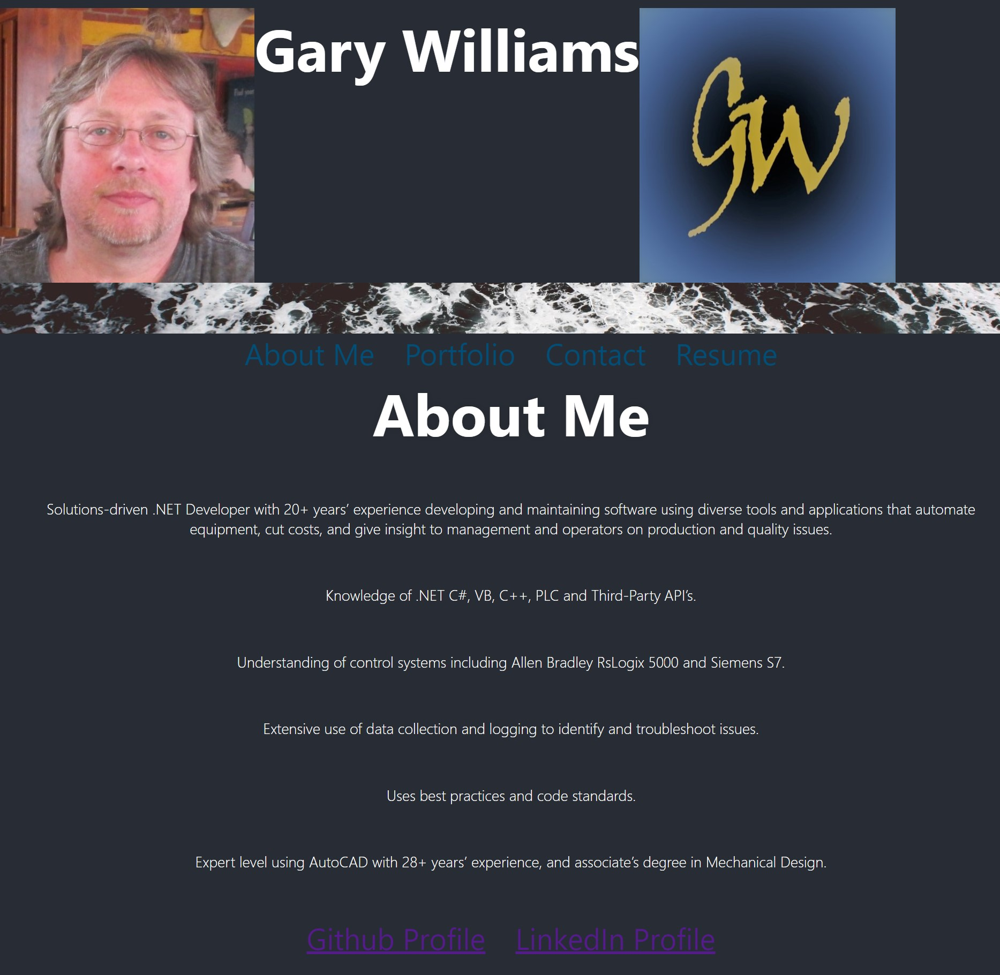
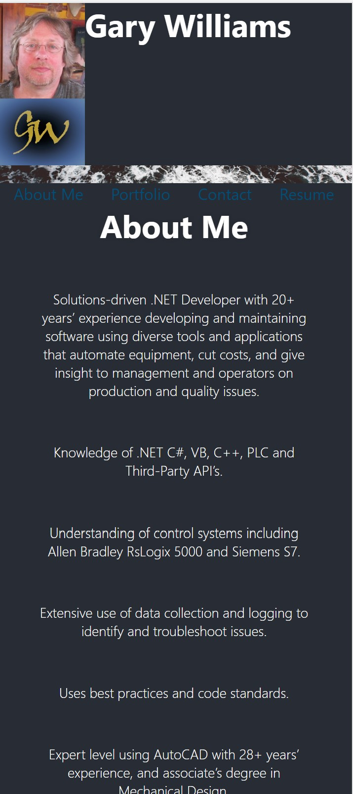

# Portfolio React

## This is a web application built using React to showcase my development projects, and deployed using github pages at [https://willig0203.github.io/portfolio-react/](https://willig0203.github.io/portfolio-react/).

## Table of Contents:

- [Installation](#installation)
- [Usage](#usage)
- [Screenshots](#screenshots)
- [License](#license)
- [Collaborators](#collaborators)
- [Contributing](#contributing)
- [Testing](#tests)
- [Questions](#questions)

## Installation

Clone the repository from [GitHub](https://github.com/willig0203/portfolio-react) onto your machine in a local folder. This program will require Node.js. Install node.js: [Installation Guide](https://coding-boot-camp.github.io/full-stack/nodejs/how-to-install-nodejs). From the root of the project folder do an npm (Node Package Manager) install to get the package dependencies (type `npm install` on the command line).

## Usage

In your teminal at the root folder type `npm start` your browser will open automatically.

OR

Use the live app: [https://willig0203.github.io/portfolio-react/](https://willig0203.github.io/portfolio-react/)

## Screenshots

|                <b>Image running on a computer</b>                 |
| :---------------------------------------------------------------: |
|  |

|               <b>Image running on a mobile device</b>                |
| :------------------------------------------------------------------: |
|  |

## License

&copy; 2022 by Gary Williams (Trademark: Garyware LLC)
This project is licensed under the MIT license.
https://opensource.org/licenses/MIT

## Collaborators:

Gary Williams

## Contributing

To contribute to this project please make a new issue or pull request.

## Tests

No test at this time.

## Questions

Contact Gary Williams at: [willig0203@gmail.com](mailto:willig0203@gmail.com) or [GitHub](https://github.com/willig0203/)
